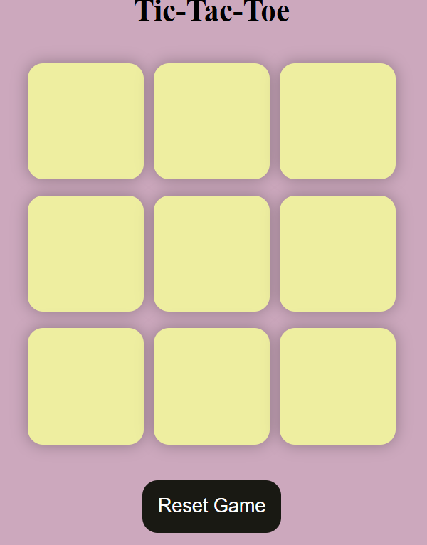

# TicTacToeGame
Tic Tac Toe Game  This is a simple and interactive Tic Tac Toe game built using (HTML, CSS, and JavaScript ). The game allows two players to take turns marking spaces in a 3×3 grid, aiming to place three of their marks in a horizontal, vertical, or diagonal row to win.

#Features
🧑‍🤝‍🧑 Two-player mode
❌⭕ Real-time game updates
🔁 Restart / Reset game functionality
🏆 Winner detection logic
🤝 Draw detection
🎯 Simple and responsive UI

#Technologies Used
HTML
CSS
JavaScript

# Game showcase

#▶️ How to Play
Player 1 starts with X, Player 2 uses O
Players take turns clicking on empty cells
First player to get 3 marks in a row (horizontal, vertical, diagonal) wins
If all cells are filled and no winner → it's a draw

###💡 Learning Outcomes
- Understanding game logic implementation
- DOM manipulation in JavaScript
- Handling user interactions
- Writing clean and structured code
